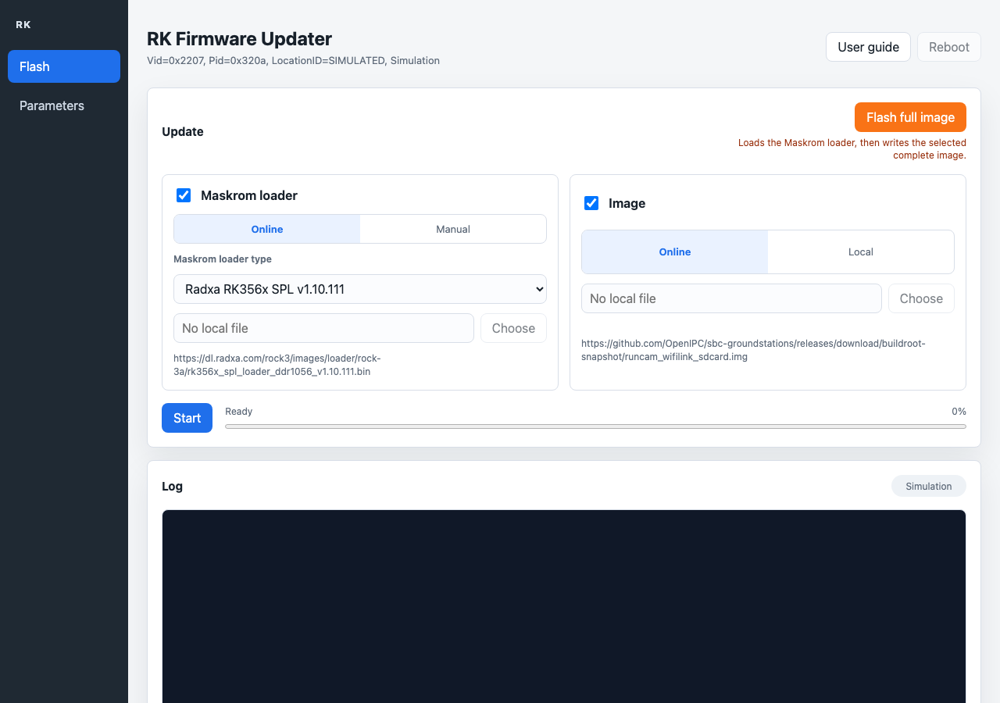

# RK Firmware Updater and rkdeveloptool

Update Rockchip Rockusb devices without memorizing terminal commands.

This repository contains:

- **RK Firmware Updater**, a standalone desktop application for macOS, Linux,
  and Windows
- **rkdeveloptool**, the command-line utility used internally by the GUI
- tests, packaging automation, and release workflows for maintainers

## For Most Users

Download the latest packaged application from:

https://github.com/krl91/rkdeveloptool-gui/releases

Then read the step-by-step guide:

[Open the user guide](docs/USER_GUIDE.md)

The packaged application includes Electron, the GUI, configuration files, and
the matching `rkdeveloptool` binary. You do not need to install Node.js,
Electron, or a separate `rkdeveloptool` binary to use the packaged app.

## Documentation Map

- [User guide](docs/USER_GUIDE.md): how to update a device with screenshots
- [GUI developer README](gui/README.md): architecture, tests, and packaging
- [Contributor guide](CONTRIBUTING.md): quality checks and release workflow
- [Command-line usage](#command-line-usage): direct `rkdeveloptool` examples

## What The GUI Does

RK Firmware Updater detects one Rockusb device, lets the user choose a loader
and/or image, verifies online downloads with SHA256, writes the loader before
the image, shows progress, and offers to reboot the device at the end.

If no device is connected, the application can start a simulation mode so users
can explore the workflow safely.

Quick Install: Command-Line Tool
--------------------------------

macOS:

	brew install automake autoconf libusb pkg-config git wget
	git clone https://github.com/krl91/rkdeveloptool-gui.git
	cd rkdeveloptool-gui
	autoreconf -i
	./configure --enable-standalone
	make -j$(sysctl -n hw.ncpu)

Linux Debian/Ubuntu:

	sudo apt-get update
	sudo apt-get install -y libudev-dev libusb-1.0-0-dev dh-autoreconf \
		pkg-config libusb-1.0 build-essential git wget
	git clone https://github.com/krl91/rkdeveloptool-gui.git
	cd rkdeveloptool-gui
	autoreconf -i
	./configure --enable-standalone
	make -j$(nproc)

Windows:

	1. Install MSYS2: https://www.msys2.org/
	2. Open the "MSYS2 UCRT64" shell.
	   Do not use the CLANG64, MINGW64, or MSYS shell for these commands.
	3. Run:

	pacman -Syu
	# If MSYS2 asks you to close the terminal after pacman -Syu, close it,
	# reopen "MSYS2 UCRT64", then continue below.
	pacman -S --needed git wget autoconf automake make pkgconf \
		mingw-w64-ucrt-x86_64-gcc \
		mingw-w64-ucrt-x86_64-pkgconf \
		mingw-w64-ucrt-x86_64-libusb

	echo $MSYSTEM
	gcc --version
	git clone https://github.com/krl91/rkdeveloptool-gui.git
	cd rkdeveloptool-gui
	autoreconf -i
	./configure --enable-standalone
	make -j$(nproc)
	strip rkdeveloptool.exe

The --enable-standalone option links libusb statically when libusb-1.0.a is
available. The binary still uses normal system libraries for the target OS.

Quick Build: Standalone GUI Application
---------------------------------------

The GUI packages Electron, the GUI files, production Node dependencies, the
default configuration, and the matching rkdeveloptool binary into one final
application package.

Prerequisites:

	- Build rkdeveloptool first on the same OS and CPU architecture.
	- Install Node.js and npm.

macOS:

	brew install automake autoconf libusb pkg-config git wget node
	git clone https://github.com/krl91/rkdeveloptool-gui.git
	cd rkdeveloptool-gui
	autoreconf -i
	./configure --enable-standalone
	make -j$(sysctl -n hw.ncpu)
	cd gui
	npm install
	npm run dist

Or build the command-line tool and the GUI package with one make command:

	autoreconf -i
	./configure --enable-standalone --enable-gui
	make -j$(sysctl -n hw.ncpu)

Linux Debian/Ubuntu:

	sudo apt-get update
	sudo apt-get install -y libudev-dev libusb-1.0-0-dev dh-autoreconf \
		pkg-config libusb-1.0 build-essential git wget nodejs npm
	git clone https://github.com/krl91/rkdeveloptool-gui.git
	cd rkdeveloptool-gui
	autoreconf -i
	./configure --enable-standalone
	make -j$(nproc)
	cd gui
	npm install
	npm run dist

Or build the command-line tool and the GUI package with one make command:

	autoreconf -i
	./configure --enable-standalone --enable-gui
	make -j$(nproc)

Windows, from the MSYS2 UCRT64 shell:

	pacman -S --needed git wget autoconf automake make pkgconf \
		mingw-w64-ucrt-x86_64-gcc \
		mingw-w64-ucrt-x86_64-pkgconf \
		mingw-w64-ucrt-x86_64-libusb \
		mingw-w64-ucrt-x86_64-nodejs
	echo $MSYSTEM
	gcc --version
	node --version
	npm --version
	git clone https://github.com/krl91/rkdeveloptool-gui.git
	cd rkdeveloptool-gui
	autoreconf -i
	./configure --enable-standalone
	make -j$(nproc)
	cd gui
	npm install
	npm run dist

Or build the command-line tool and the GUI package with one make command:

	autoreconf -i
	./configure --enable-standalone --enable-gui
	make -j$(nproc)

Build output:

	gui/dist/

Use this for a faster unpacked test build:

	cd gui
	npm run dist:dir

The GUI automatically copies ../rkdeveloptool or ../rkdeveloptool.exe into
gui/bin/ before packaging.

When configure is run with --enable-gui, the normal make target also builds
the Electron package. Without --enable-gui, the command-line tool remains the
default build and the GUI can still be built manually with:

	make gui

Useful GUI make targets:

	make gui
		Build the final Electron package, same as npm run dist.

	make gui-package
		Build the final Electron package. This is an alias for make gui.

	make gui-dist
		Build the final Electron package. This is the lower-level target used
		by make gui and make gui-package.

	make gui-dist-dir
		Build a faster unpacked Electron package, same as npm run dist:dir.

	make gui-test
		Run the GUI automatic tests.

	make gui-clean
		Remove GUI build outputs and copied rkdeveloptool binaries.

	make clean
		Remove command-line build outputs, logs, GUI build outputs, and copied
		GUI rkdeveloptool binaries. It keeps gui/node_modules/ intact.

GitHub Actions runs make gui-test on pull requests. A separate macOS release
workflow can build a signed and notarized DMG when the required Apple signing
secrets are configured.

The automatic test procedure is documented in the next section.

Automatic Tests
---------------

The automatic tests are in the gui/tests/ directory and can be run without a
Rockusb device connected. They use a mock rkdeveloptool for integration tests,
so no real hardware is flashed.

From the repository root:

	cd gui
	npm install
	npm run check
	npm test
	npm run coverage

The commands do the following:

	npm run check
		Check JavaScript syntax for the GUI sources, scripts, and tests.

	npm test
		Run the unit and integration tests with Node.js built-in test runner.

	npm run coverage
		Run the same tests and print the coverage report.

The tests cover configuration loading, rkdeveloptool output parsing, binary
discovery, SHA256 helpers, update ordering, simulation mode, mock integration
with rkdeveloptool, reboot handling, and GUI layout regressions.

For contribution guidelines, project layout, quality checks, and packaging
notes, see:

	CONTRIBUTING.md

GUI Configuration
-----------------

The default GUI configuration is:

	gui/config/default.json

Override it with a rkdeveloptool-gui.config.json file in the current working
directory, in the Electron user data directory, or by setting:

	RKDEVELOPTOOL_GUI_CONFIG=/path/to/rkdeveloptool-gui.config.json

The firmware release page URL, GitHub API URL, loader URL, image URL, asset
names, and image LBA are configurable. Online downloads are verified with
SHA256 before flashing.

USB Notes
---------

Linux:

	Install a udev rule or run with suitable privileges. A sample rule is
	provided in 99-rk-rockusb.rules.

Windows:

	The Rockusb device must use a libusb-compatible driver such as WinUSB.
	Zadig can install WinUSB for the connected Rockusb device.

macOS:

	Use a build linked against the local libusb package, preferably via
	--enable-standalone as shown above.

Command-Line Usage
------------------

Run:

	./rkdeveloptool -h

Common example:

	sudo ./rkdeveloptool db RKXXLoader.bin
	sudo ./rkdeveloptool wl 0x8000 kernel.img
	sudo ./rkdeveloptool rd

In this example, 0x8000 is the base sector of the target partition.

Troubleshooting
---------------

If configure fails with:

	./configure: line 4269: syntax error near unexpected token `LIBUSB1,libusb-1.0'
	./configure: line 4269: `PKG_CHECK_MODULES(LIBUSB1,libusb-1.0)'

Install pkg-config and libusb development files.

Debian/Ubuntu:

	sudo apt-get install pkg-config libusb-1.0-0-dev

macOS:

	brew install pkg-config libusb

Windows/MSYS2:

	If configure fails with:

		configure: error: no acceptable C compiler found in $PATH

	check the MSYS2 shell. The documented commands install UCRT64 packages, so
	the prompt must show UCRT64 and this command must print UCRT64:

		echo $MSYSTEM

	If it prints CLANG64, MINGW64, or MSYS, close that terminal and open
	"MSYS2 UCRT64" from the Start menu. Then verify:

		gcc --version

	If you intentionally want to build from the CLANG64 shell instead, install
	the matching CLANG64 packages instead of the UCRT64 packages:

		pacman -S --needed git wget autoconf automake make pkgconf \
			mingw-w64-clang-x86_64-clang \
			mingw-w64-clang-x86_64-pkgconf \
			mingw-w64-clang-x86_64-libusb

	If npm is not found when building the GUI:

		-bash: npm: command not found

	install Node.js in the same UCRT64 shell. The MSYS2 Node.js package also
	provides npm:

		pacman -S --needed mingw-w64-ucrt-x86_64-nodejs
		hash -r
		node --version
		npm --version
