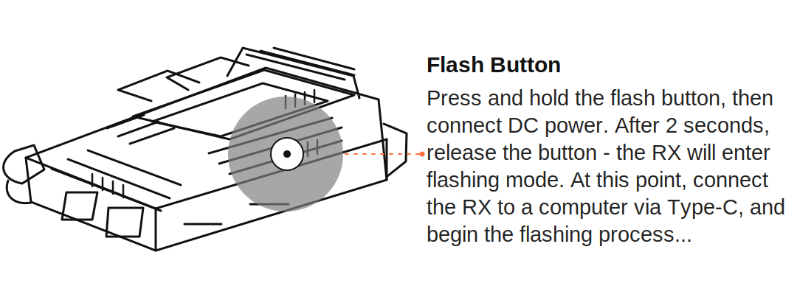

# RK Firmware Updater User Guide

RK Firmware Updater is a desktop application for updating Rockchip Rockusb
devices with a loader and/or a disk image. It is designed for users who do not
want to run `rkdeveloptool` commands manually.

The application is available for macOS, Linux, and Windows. A packaged build
contains the GUI, Electron runtime, configuration files, and the matching
`rkdeveloptool` binary.

## Before You Start

You need:

- a Rockchip device in Rockusb, Maskrom, or Loader mode
- the correct USB cable
- operating-system USB access configured
- enough time to let the image write complete without unplugging the device

Platform notes:

- **Windows:** usually, no extra software is required. First connect the
  ground station in Maskrom/Loader mode and start the updater. If the
  application still does not detect it, use the free Zadig tool from
  https://zadig.akeo.ie/ to select the Rockusb/Maskrom/Loader USB entry and
  assign the WinUSB driver. WinUSB is included with Windows; Zadig only changes
  which driver Windows uses for the selected USB entry.
- **Linux:** install a udev rule or run the application with suitable USB
  privileges.
- **macOS:** no separate driver is usually required, but the application may
  ask for permission depending on the local security settings.

## Put A RunCam WiFiLink RX In Flash Mode

For a RunCam WiFiLink RX or OpenIPC ground station, the receiver must be in
Rockusb/Maskrom flash mode before RK Firmware Updater starts. Use the USB-C
data port and the recessed reset/flash button.



1. Unplug the receiver.
2. Press and hold the reset/flash button with a paper clip, SIM eject tool, or
   small screwdriver.
3. While holding the button, connect the USB-C data cable to the computer.
4. Keep holding the button for about 2 seconds, then release it.
5. Click **Try again** in RK Firmware Updater.

If your receiver also needs separate DC power, apply DC power while holding the
button, wait about 2 seconds, then release it.

If the application still does not detect the receiver, try another USB-C data
cable, connect directly to the computer without a hub, and confirm that the
USB-C port used is the data/flash port.

## Start The Application

Launch **RK Firmware Updater**.

If no device is detected, the application offers two choices. The exact dialog
style follows your operating system, but the choices are the same:

- **Try again** runs device detection again without restarting the application.
- **Simulate** starts a safe demo mode. It does not flash real hardware.
- **Close** closes the application so you can connect the device and try again.

The dialog also reminds RunCam WiFiLink RX users to connect the USB-C cable
while holding the reset/flash button for about 2 seconds before trying
detection again.


If one device is detected, the main window opens directly.

On Windows, use Zadig only if the device is connected in Maskrom/Loader mode
but the application still does not detect it:

1. Download Zadig from https://zadig.akeo.ie/
2. Start Zadig.
3. Enable **Options -> List All Devices** if needed.
4. Select the Rockusb/Maskrom/Loader USB entry for the ground station.
5. Choose **WinUSB** as the target driver.
6. Click **Install Driver** or **Replace Driver**.
7. Restart RK Firmware Updater.

Select only the ground station USB entry. Do not replace drivers for unrelated
USB devices such as keyboards, mice, storage devices, or debug adapters.

## Main Window

The top of the window shows the detected USB device. In simulation mode, the
device line clearly says `Simulation`.

Use **User guide** in the top-right corner to open the online documentation in
your default web browser.


The **Update** section contains two independent firmware parts:

- **Loader:** written first with `rkdeveloptool db <loader>`
- **Image:** written after the loader with `rkdeveloptool wl 0 <image>`

You can update only the loader, only the image, or both. When both are selected,
the application always writes the loader before the image.

## Choose Online Or Local Files

Each firmware part has two source choices:

- **Online:** download the configured file from the configured release URLs
- **Local:** select a file already present on your computer

Online files are verified with SHA256 before flashing. Local files are not
matched against the online release checksum because they may be custom builds.

The configured default URLs are visible in the window. They can be changed by
editing the GUI configuration file. See [GUI configuration](../README.md#gui-configuration).

## One-Click Online Update

Use **Latest loader + image** when you want the recommended online update in
one action.

This button is highlighted because it performs the full update sequence:

1. download the latest configured loader
2. verify the loader SHA256
3. write the loader
4. download the latest configured image
5. verify the image SHA256
6. write the image

The application asks for confirmation before it starts writing anything.


## During The Update

Keep the device connected and do not close the application while the update is
running. The progress bar and log show what is happening.


The log includes:

- download status
- SHA256 verification status
- the `rkdeveloptool` command being executed
- write progress when `rkdeveloptool` reports it
- errors returned by `rkdeveloptool`

If an error occurs, the status changes to **Error** and the log keeps the
command output so it can be shared for support.

## Finish And Reboot

When the update is complete, the status changes to **Done** and the application
offers to reboot the device.


Choose reboot when you are ready to restart the target device. The application
uses `rkdeveloptool rd`.

## Safety Checklist

Before flashing real hardware:

- confirm the selected device is the expected one
- confirm whether you selected loader, image, or both
- confirm whether each selected file is online or local
- use the log to verify SHA256 status for online files
- wait for **Done** before unplugging the device

## Configuration For Administrators

The default configuration is stored in:

```text
gui/config/default.json
```

The application also reads `rkdeveloptool-gui.config.json` from the current
working directory, the Electron user data directory, or the path configured by:

```text
RKDEVELOPTOOL_GUI_CONFIG=/path/to/rkdeveloptool-gui.config.json
```

Configurable values include the GitHub release page, GitHub API URL, loader
URL, image URL, asset names, image LBA, online user guide URL, and network
timeouts.

Default network timeouts are deliberately long:

```json
{
  "network": {
    "metadataTimeoutMs": 300000,
    "downloadTimeoutMs": 7200000
  }
}
```

If a custom configuration file is loaded, the main window shows a warning
banner and the confirmation dialog lists the active source hosts before the
update starts.

## Related Documentation

- [Project README](../README.md) for download, build, and command-line notes
- [GUI developer README](../gui/README.md) for architecture, tests, and packaging
- [Contributor guide](../CONTRIBUTING.md) for quality checks and release notes
