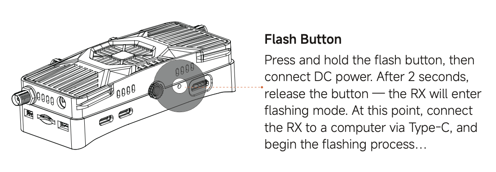
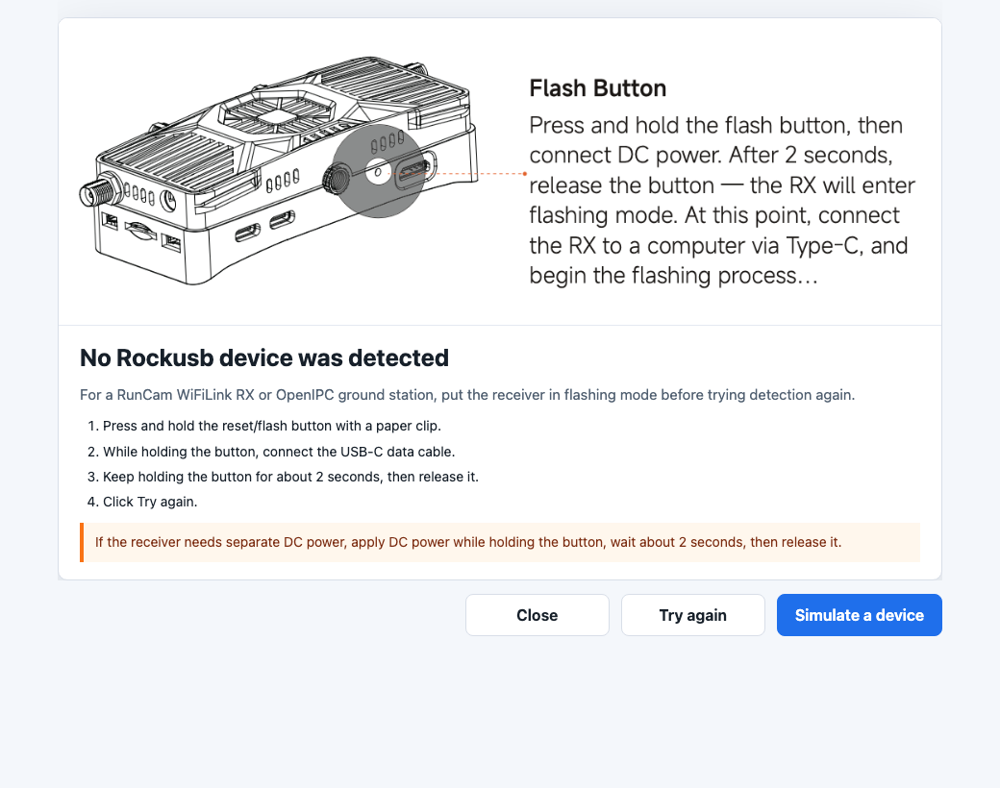
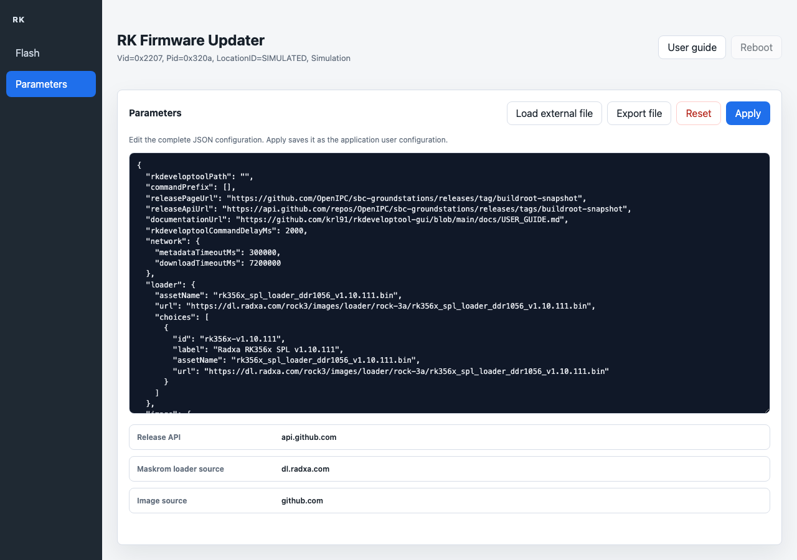
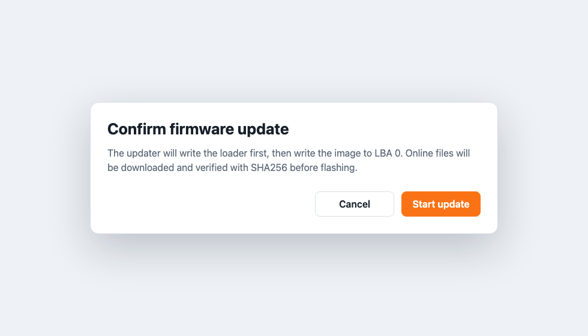
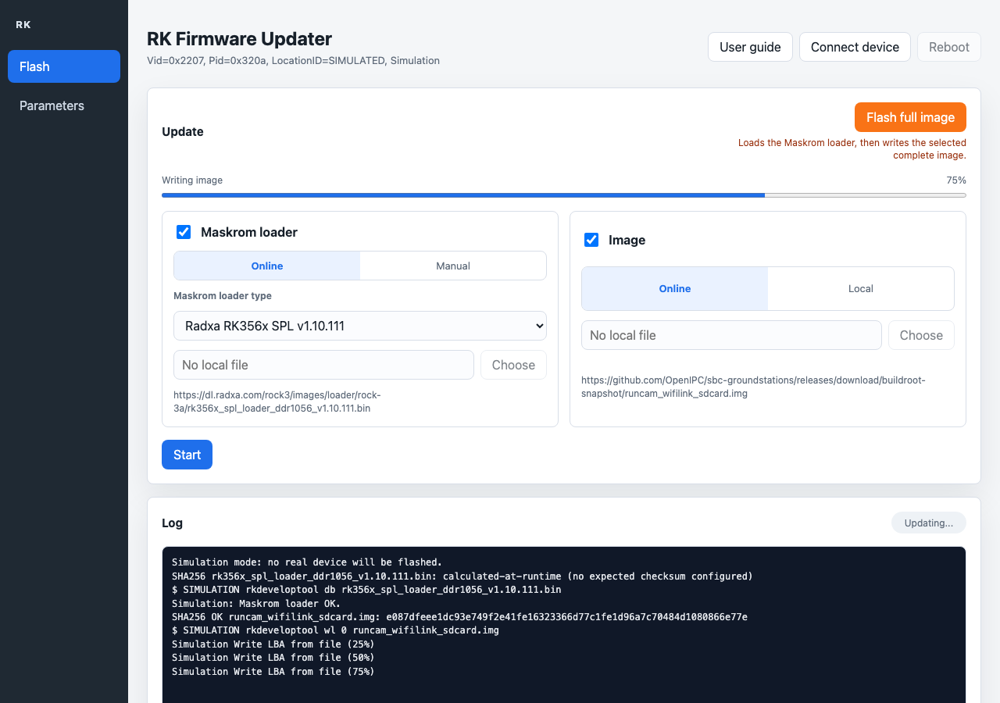

# RK Firmware Updater User Guide

RK Firmware Updater is a desktop application for updating Rockchip Rockusb
devices with a loader and/or a disk image. It is designed for users who do not
want to run `rkdeveloptool` commands manually.

The application is available for macOS, Linux, and Windows. A packaged build
contains the GUI, Electron runtime, configuration files, and the matching
`rkdeveloptool` binary.

## Before You Start

You need:

- a Rockchip device in Rockusb, Maskrom, or Loader mode
- the correct USB cable
- operating-system USB access configured
- enough time to let the image write complete without unplugging the device

Platform notes:

- **Windows:** usually, no extra software is required. First connect the
  ground station in Maskrom/Loader mode and start the updater. If the
  application still does not detect it, use the free Zadig tool from
  https://zadig.akeo.ie/ to select the Rockusb/Maskrom/Loader USB entry and
  assign the WinUSB driver. WinUSB is included with Windows; Zadig only changes
  which driver Windows uses for the selected USB entry.
- **Linux:** install a udev rule or run the application with suitable USB
  privileges.
- **macOS:** no separate driver is usually required, but the application may
  ask for permission depending on the local security settings.

## Put A RunCam WiFiLink RX In Flash Mode

For a RunCam WiFiLink RX or OpenIPC ground station, the receiver must be in
Rockusb/Maskrom flash mode before RK Firmware Updater starts. Use the USB-C
data port and the recessed reset/flash button.



1. Unplug the receiver.
2. Press and hold the reset/flash button with a paper clip, SIM eject tool, or
   small screwdriver.
3. While holding the button, connect the USB-C data cable to the computer.
4. Keep holding the button for about 2 seconds, then release it.
5. Click **Try again** in RK Firmware Updater.

If your receiver also needs separate DC power, apply DC power while holding the
button, wait about 2 seconds, then release it.

If the application still does not detect the receiver, try another USB-C data
cable, connect directly to the computer without a hub, and confirm that the
USB-C port used is the data/flash port.

## Start The Application

Launch **RK Firmware Updater**.

If no device is detected, the application offers two choices. The exact dialog
style follows your operating system, but the choices are the same:

- **Try again** runs device detection again without restarting the application.
- **Simulate** starts a safe demo mode. It does not flash real hardware.
- **Close** closes the application so you can connect the device and try again.

The dialog also reminds RunCam WiFiLink RX users to connect the USB-C cable
while holding the reset/flash button for about 2 seconds before trying
detection again.



If one device is detected, the main window opens directly.

On Windows, use Zadig only if the device is connected in Maskrom/Loader mode
but the application still does not detect it:

1. Download Zadig from https://zadig.akeo.ie/
2. Start Zadig.
3. Enable **Options -> List All Devices** if needed.
4. Select the Rockusb/Maskrom/Loader USB entry for the ground station.
5. Choose **WinUSB** as the target driver.
6. Click **Install Driver** or **Replace Driver**.
7. Restart RK Firmware Updater.

Select only the ground station USB entry. Do not replace drivers for unrelated
USB devices such as keyboards, mice, storage devices, or debug adapters.

## Main Window

The top of the window shows the detected USB device. In simulation mode, the
device line clearly says `Simulation`.

Use **User guide** in the top-right corner to open the online documentation in
your default web browser.

The left side of the window contains two tabs:

- **Flash:** the normal update workflow for loading a Maskrom loader and/or
  writing an image.
- **Parameters:** the full JSON configuration editor for advanced settings.

At startup, the application can also check the GitHub release page for a newer
RK Firmware Updater version. If your computer is offline, this check is skipped.
When a newer version is available, the application asks before downloading the
installer. The download is verified before the installer starts; if the download
is partial or invalid, the current application is left unchanged.


The **Update** section contains the two parts used by the full Maskrom flash
workflow:

- **Maskrom loader:** loaded first with `rkdeveloptool db <radxa-spl-loader>`
- **Image:** complete OpenIPC image written with `rkdeveloptool wl 0 <image>`

For the normal full-image workflow, keep both selected. If the image is selected
while the device is still in Maskrom mode, the application loads the configured
Maskrom loader before writing the image.

## Choose Online Or Local Files

Each firmware part has two source choices:

- **Online:** download the configured file from the configured URLs
- **Manual:** select a loader file already present on your computer
- **Local:** select an image file already present on your computer

For the Maskrom loader, online mode provides a loader type list. The default list
contains Radxa RK356x SPL loaders suitable for `rkdeveloptool db`, not the
OpenIPC `u-boot.bin` file. Use **Manual** only when you already have a Rockchip
loader file suitable for `rkdeveloptool db`.

Online image files are verified with SHA256 before flashing. Local files are not
matched against the online release checksum because they may be custom builds.
Some direct loader URLs do not publish an expected checksum; in that case the
application logs the calculated SHA256 for traceability.

The configured default URLs are visible in the window. They can be changed by
editing the GUI configuration file. See [GUI configuration](../README.md#gui-configuration).

## Parameters Tab

Use the **Parameters** tab when you need to inspect or edit the complete JSON
configuration used by the application.



The editor shows the active JSON configuration. It is intended for advanced
users and maintainers who need to change URLs, loader choices, image names,
timeouts, update behavior, or local command settings.

Available actions:

- **Load external file:** reads a JSON file from your computer and replaces the
  editor contents. The configuration is not used until you click **Apply**.
- **Export file:** saves a copy of the JSON currently shown in the editor.
- **Reset:** restores the packaged default configuration after confirmation.
- **Apply:** validates the JSON, saves it as the user configuration, and applies
  it immediately.

If the JSON is invalid, the application keeps the previous configuration and
shows an error. Reset is useful if a manual edit prevents downloads or flashing
from working correctly.

## Full Image Flash

Use **Flash full image** when you want to run the complete flashing sequence in
one action. The button keeps the source choices currently selected in the GUI:
if the image source is set to **Local**, it writes the selected local image
instead of downloading the configured GitHub image.

This button is highlighted because it performs the full update sequence:

1. prepare the selected Maskrom loader, online or manual
2. load the Maskrom loader with `rkdeveloptool db`
3. prepare the selected complete image, online or local
4. verify SHA256 when an expected online checksum is available, or log the local file SHA256
5. write the complete image with `rkdeveloptool wl 0`

The application asks for confirmation before it starts writing anything.



## During The Update

Keep the device connected and do not close the application while the update is
running. The progress bar and log show what is happening.



The log includes:

- download status
- SHA256 verification status
- the `rkdeveloptool` command being executed
- write progress when `rkdeveloptool` reports it
- errors returned by `rkdeveloptool`

If an error occurs, the status changes to **Error** and the log keeps the
command output so it can be shared for support.

## Finish And Reboot

When the update is complete, the status changes to **Done** and the application
offers to reboot the device.


Choose reboot when you are ready to restart the target device. The application
uses `rkdeveloptool rd`.

## Safety Checklist

Before flashing real hardware:

- confirm the selected device is the expected one
- confirm whether you selected loader, image, or both
- confirm whether each selected file is online or local
- use the log to verify SHA256 status for online files
- wait for **Done** before unplugging the device

## Configuration For Administrators

The default configuration is stored in:

```text
gui/config/default.json
```

The application also reads `rkdeveloptool-gui.config.json` from the current
working directory, the Electron user data directory, or the path configured by:

```text
RKDEVELOPTOOL_GUI_CONFIG=/path/to/rkdeveloptool-gui.config.json
```

Configurable values include the GitHub release page, GitHub API URL, loader
URL, image URL, asset names, image LBA, online user guide URL, and network
timeouts. Application self-update checks can also be configured or disabled
with the `autoUpdate` section. The delay between consecutive `rkdeveloptool`
commands is configurable with `rkdeveloptoolCommandDelayMs`; the default is
2000 ms so the USB device has time to settle between operations.

The same configuration can be viewed and edited from the **Parameters** tab in
the application. Click **Apply** to save changes to the Electron user data
configuration file, or **Reset** to restore the packaged defaults.

Default network timeouts are deliberately long:

```json
{
  "network": {
    "metadataTimeoutMs": 300000,
    "downloadTimeoutMs": 7200000
  },
  "rkdeveloptoolCommandDelayMs": 2000,
  "autoUpdate": {
    "enabled": true,
    "checkOnStartup": true,
    "metadataTimeoutMs": 300000,
    "downloadTimeoutMs": 7200000,
    "installTimeoutMs": 1800000,
    "linuxPackage": "deb"
  }
}
```

### Configuration Reference

The **Parameters** tab edits the same JSON structure as
`rkdeveloptool-gui.config.json`. The table below documents every supported
default parameter.

| Parameter | Type | Unit | Description |
| --- | --- | --- | --- |
| `rkdeveloptoolPath` | string | File path | Optional explicit path to `rkdeveloptool` or `rkdeveloptool.exe`. Leave empty to let the application search packaged resources, the development bundle, the repository root, then `PATH`. |
| `commandPrefix` | string array | Command arguments | Optional privilege wrapper placed before `rkdeveloptool`. Supported wrappers are `sudo`, `pkexec`, and `doas`; only safe non-interactive arguments such as `-n` are accepted where supported. The default empty array runs `rkdeveloptool` directly. |
| `releasePageUrl` | string | URL | Human-readable firmware release page. It is used as a fallback source for the GitHub API URL and is shown in diagnostics. |
| `releaseApiUrl` | string | URL | GitHub release API endpoint used to find online firmware assets and their SHA256 metadata. |
| `documentationUrl` | string | URL | Online guide opened by the **User guide** link in the application. |
| `rkdeveloptoolCommandDelayMs` | number | Milliseconds | Delay inserted between consecutive `rkdeveloptool` commands such as `ld`, `db`, `wl`, and `rd`. The default is `2000` ms to let the USB device settle. |
| `network.metadataTimeoutMs` | number | Milliseconds | Timeout for firmware release metadata and checksum text requests. Default: `300000` ms. |
| `network.downloadTimeoutMs` | number | Milliseconds | Timeout for firmware loader/image downloads. Default: `7200000` ms. Large images can take a long time on slow links. |
| `autoUpdate.enabled` | boolean | none | Enables or disables application self-update support. Set to `false` to disable update checks and update installation. |
| `autoUpdate.checkOnStartup` | boolean | none | When `true`, the application checks for a newer RK Firmware Updater release during startup. The check is skipped if the operating system reports that the computer is offline. |
| `autoUpdate.releaseApiUrl` | string | URL | GitHub API endpoint used to find new RK Firmware Updater releases. This is separate from the firmware release API. |
| `autoUpdate.metadataTimeoutMs` | number | Milliseconds | Timeout for the application update metadata request. Default: `300000` ms. |
| `autoUpdate.downloadTimeoutMs` | number | Milliseconds | Timeout for downloading an application update installer/package. Default: `7200000` ms. |
| `autoUpdate.installTimeoutMs` | number | Milliseconds | Timeout for running the downloaded application update installer. Default: `1800000` ms. |
| `autoUpdate.linuxPackage` | string | Package type | Linux update package preference. Supported values are `deb`, `rpm`, and `appimage`; default is `deb`. |
| `loader.assetName` | string | File name | Default online Maskrom loader file name. Used when no specific `loader.choices` entry is selected. |
| `loader.url` | string | URL | Default direct download URL for the Maskrom loader. |
| `loader.choices` | array | Loader list | List of online Maskrom loader choices displayed in the **Maskrom loader type** dropdown. |
| `loader.choices[].id` | string | Identifier | Stable internal identifier for a loader choice. It should be unique within `loader.choices`. |
| `loader.choices[].label` | string | Display text | User-facing loader name shown in the dropdown and confirmation dialog. |
| `loader.choices[].assetName` | string | File name | File name used for the downloaded loader choice and cache entry. |
| `loader.choices[].url` | string | URL | Direct download URL for this loader choice. |
| `image.assetName` | string | File name | Online image file name expected in the firmware release. |
| `image.url` | string | URL | Direct download URL for the complete OpenIPC image. |
| `image.lba` | number | LBA sector offset | Start address passed to `rkdeveloptool wl`. The default is `0` for complete `*_sdcard.img` images. |

Notes:

- The Maskrom loader used by `rkdeveloptool db` must be a Rockchip/Radxa SPL
  loader. OpenIPC `*_u-boot.bin` files are not valid Maskrom loaders.
- The application validates JSON before applying it. If validation fails, the
  previous active configuration remains in use.
- Use **Reset** in the **Parameters** tab to restore the packaged defaults after
  an unsafe or broken edit.

If a custom configuration file is loaded, the main window shows a warning
banner and the confirmation dialog lists the active source hosts before the
update starts.

## Related Documentation

- [Project README](../README.md) for download, build, and command-line notes
- [GUI developer README](../gui/README.md) for architecture, tests, and packaging
- [Contributor guide](../CONTRIBUTING.md) for quality checks and release notes
